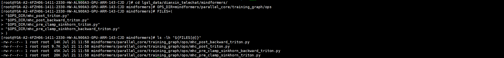
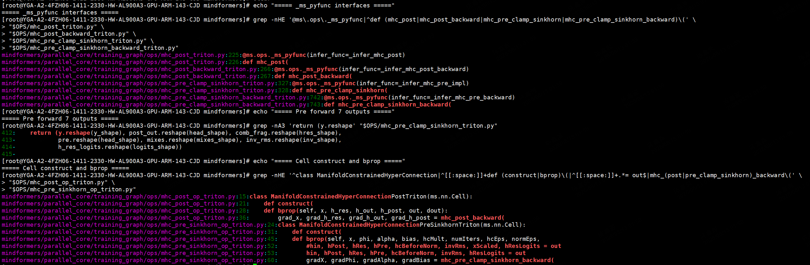
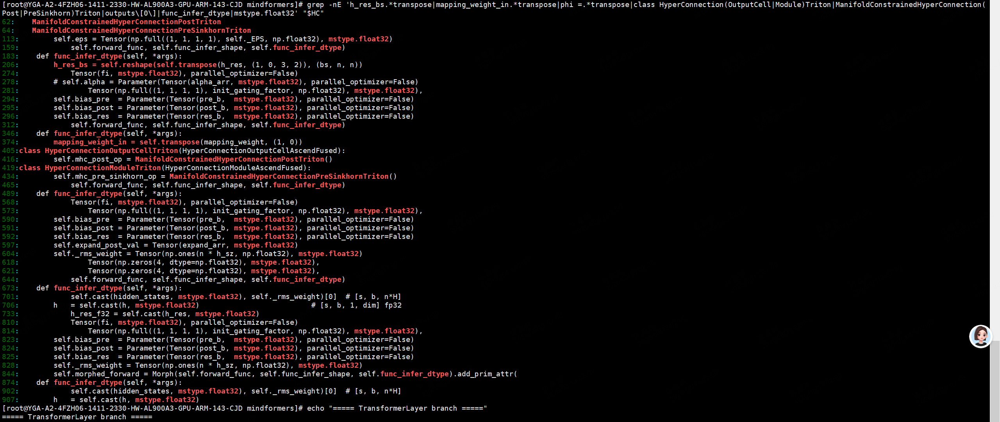
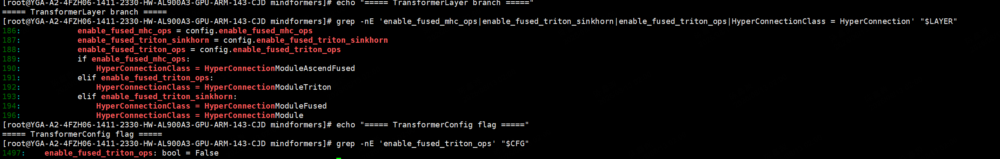
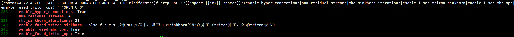
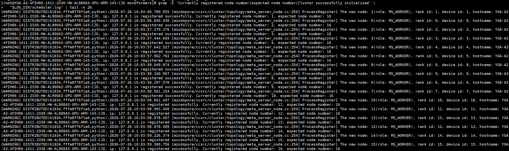
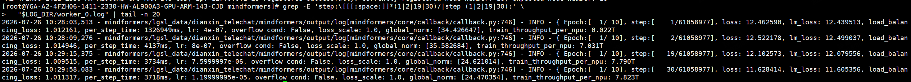

# 在 MindFormers 中接入 FlagOS-mHC Triton 算子并验证 Xing4.0-29B-A4B 单机 16 卡训练

本文介绍如何在 Xing4.0-29B-A4B 模型中接入 Triton-Ascend mHC 算子，并基于 MindFormers 完成单机 16 卡训练验证。

## 0. 准备源码

请提前准备以下材料：

| 物料 | 用途 | 获取方式 |
| --- | --- | --- |
| 4 个 FlagOS-mHC Torch 算子文件 | 待接入 MindSpore 的自定义算子 | https://github.com/liuhycs/FlagOS-mhc |
| MindFormers 源码 | 待修改的目标框架 | `git clone -b r1.9.0-beta1 https://gitcode.com/mindspore/mindformers.git` |
| A3 CANN 基础镜像 | CANN 9.0.0、Python 3.11 和 Triton-Ascend 编译依赖 | [Ascend 官方公开 Quay 镜像与 Dockerfile](https://quay.io/repository/ascend/triton?tab=info) |
| MindSpore 2.10.0 | MindSpore 运行环境 | [MindSpore 官方公开 Python 包索引](https://repo.mindspore.cn/pypi/simple/mindspore/) |
| Xing4.0-29B-A4B 模型代码、配置、权重、数据集 | 训练内容 | Hugging Face / ModelScope |
| Xing4.0-29B-A4B + mHC 训练 YAML | 训练配置 | Xing4.0-29B-A4B 模型包中提供，按第 7 节修改 |
| hyper-parallel | 昇腾超节点分布式并行加速库 | `git clone https://gitcode.com/mindspore/hyper-parallel` |

请将以下 4 个算子文件准备在同一目录中。本文统一使用 `FLAGOS_OPS` 指代该目录：

```text
FLAGOS_OPS/mhc_post.py
FLAGOS_OPS/mhc_post_backward.py
FLAGOS_OPS/mhc_pre_clamp_sinkhorn.py
FLAGOS_OPS/mhc_pre_clamp_sinkhorn_backward.py
```

> 文档中的 `/path/to/...` 等占位路径需要替换为实际路径。

**注意事项**

1. 官方源码中**不包含 `hyper-parallel` 目录**。该组件是独立仓库，需要单独 clone 并安装。

---

## 1. 准备源码并构建镜像

本节命令均在**宿主机**执行。基础镜像使用 Ascend 官方公开 Quay 仓库中的 A3 镜像，提供 openEuler 24.03、Python 3.11、CANN 9.0.0、clang、cmake、ninja 和 LLVM 编译环境。MindSpore 2.10.0、torch-npu 2.10.0、Triton 3.6.0 从公开 Python 包索引安装，Triton-Ascend 3.6.0 从公开 `release/3.6.x` 源码分支编译，MindFormers 和 hyper-parallel 从公开 GitCode 仓库下载。

创建镜像构建目录：

```bash
mkdir -p mindformers-triton-image
cd mindformers-triton-image
```

在该目录中新建 `Dockerfile`，内容如下：

```dockerfile
FROM --platform=linux/arm64 quay.io/ascend/triton:3.2.1-cann9.0.0-torch_npu2.7.1.post4-a3-openeuler24.03-py3.11@sha256:cc6bdaf3e9f4ac37ef69375d8b651b15c5541113bff5355c307105077248d3f4
ARG MAX_JOBS=8
SHELL ["/bin/bash", "-c"]
ENV TORCH_DEVICE_BACKEND_AUTOLOAD=0
RUN python -m pip install --no-cache-dir --upgrade pip setuptools wheel
RUN python -m pip uninstall -y triton-ascend triton torch-npu || true
RUN python -m pip install --no-cache-dir --extra-index-url https://repo.mindspore.cn/pypi/simple mindspore==2.10.0 torch-npu==2.10.0 triton==3.6.0
RUN mkdir -p /opt/src && git clone --depth 1 --recurse-submodules --branch release/3.6.x https://gitcode.com/Ascend/triton-ascend.git /opt/src/triton-ascend
RUN python -m pip install --no-cache-dir -r /opt/src/triton-ascend/requirements_dev.txt
RUN cd /opt/src/triton-ascend/python && LLVM_SYSPATH=/usr/local/llvm-install TRITON_VERSION=3.6.0 TRITON_WHEEL_NAME=triton-ascend TRITON_BUILD_WITH_CLANG_LLD=true TRITON_BUILD_PROTON=OFF TRITON_APPEND_CMAKE_ARGS="-DTRITON_BUILD_UT=OFF" MAX_JOBS=${MAX_JOBS} IS_MANYLINUX=True python setup.py bdist_wheel && python -m pip install --no-cache-dir dist/triton_ascend-3.6.0-*.whl
RUN git clone --depth 1 --branch r1.9.0-beta1 https://gitcode.com/mindspore/mindformers.git /opt/src/mindformers && git clone --depth 1 https://gitcode.com/mindspore/hyper-parallel.git /opt/src/hyper-parallel
RUN python -m pip install --no-cache-dir -e /opt/src/mindformers -e /opt/src/hyper-parallel
ENV PYTHONPATH=/opt/src/hyper-parallel:/opt/src/mindformers:${PYTHONPATH}
WORKDIR /opt/src/mindformers
RUN test "$(uname -m)" = "aarch64" && python -c "import mindspore as ms; import mindformers; import hyper_parallel; import triton; import torch_npu; from importlib.metadata import version; assert ms.__version__ == '2.10.0'; assert version('mindformers') == '1.9.0'; assert version('triton') == '3.6.0'; assert version('triton-ascend') == '3.6.0'; assert version('torch-npu') == '2.10.0'; assert hasattr(ms.ops, '_ms_pyfunc'); print('environment check passed')"
CMD ["/bin/bash"]
```

该 Dockerfile 使用的基础镜像标签和公开 Dockerfile 可在 [Ascend 官方 Quay 仓库说明](https://quay.io/repository/ascend/triton?tab=info) 中查看；MindSpore 2.10.0、torch-npu 2.10.0 和 Triton 3.6.0 的 Linux ARM64 CPython 3.11 wheel 可在 [PyPI](https://pypi.org/) 和 [MindSpore 官方包索引](https://repo.mindspore.cn/pypi/simple/mindspore/) 中查看；Triton-Ascend 3.6.x 的源码和公开构建脚本位于 [Ascend/triton-ascend](https://gitcode.com/Ascend/triton-ascend/tree/release/3.6.x)。

确认当前目录为 `mindformers-triton-image/` 后构建镜像。`docker build` 会自动拉取公开基础镜像并在线安装其余依赖：

```bash
sudo -E docker build --network host --build-arg MAX_JOBS=8 -f Dockerfile -t xing4.0-29b-a4b-mhc-triton:public .
sudo docker image inspect xing4.0-29b-a4b-mhc-triton:public --format 'IMAGE={{index .RepoTags 0}} ID={{.Id}} CREATED={{.Created}} ARCH={{.Architecture}}'
```

执行成功后，构建日志中应出现 `environment check passed`，镜像检查命令应显示 `IMAGE=xing4.0-29b-a4b-mhc-triton:public` 和 `ARCH=arm64`。

---

## 2. 启动容器

本节命令均在**宿主机**执行。首先确认宿主机具有 16 个逻辑 NPU 设备节点：

```bash
NPU_COUNT=$(find /dev -maxdepth 1 -name 'davinci[0-9]*' | wc -l)
echo "NPU_COUNT=$NPU_COUNT"
test "$NPU_COUNT" -eq 16
```

创建工作目录并启动容器：

```bash
mkdir -p "$PWD/xing4.0-29b-a4b-workspace"
HOST_WORKSPACE="$PWD/xing4.0-29b-a4b-workspace"
IMAGE=xing4.0-29b-a4b-mhc-triton:public
CONTAINER=xing4.0_29b_a4b_mhc_triton_ops
sudo docker run -itd --user 0 --name "$CONTAINER" --privileged --security-opt label=disable --network host --ipc host --device=/dev/davinci_manager --device=/dev/devmm_svm --device=/dev/hisi_hdc -v /usr/local/Ascend/driver:/usr/local/Ascend/driver:ro -v /usr/local/Ascend/add-ons:/usr/local/Ascend/add-ons:ro -v /usr/local/dcmi:/usr/local/dcmi:ro -v /usr/local/sbin/npu-smi:/usr/local/sbin/npu-smi:ro -v /etc/ascend_install.info:/etc/ascend_install.info:ro -v "$HOST_WORKSPACE:/workspace" -w /workspace "$IMAGE" /bin/bash
sudo docker ps --filter "name=^/${CONTAINER}$" --format 'NAMES={{.Names}} STATUS={{.Status}} IMAGE={{.Image}}'
sudo docker exec "$CONTAINER" bash -lc 'echo "container_npu_count=$(find /dev -maxdepth 1 -name "davinci[0-9]*" | wc -l)"; npu-smi info | sed -n "1,38p"'
sudo docker exec -it "$CONTAINER" /bin/bash
```

执行后，`docker ps` 中容器状态应为 `Up`，容器内应显示 `container_npu_count=16`，且 `npu-smi info` 能够读取设备信息。

---

## 3. 检查环境

本节命令均在**容器内**执行。Dockerfile 已从公开仓库将 MindFormers 下载到 `/opt/src/mindformers`：

```bash
source /usr/local/Ascend/ascend-toolkit/set_env.sh
export CODE_DIR=/opt/src/mindformers
cd "$CODE_DIR"
export PYTHONPATH="$CODE_DIR:/opt/src/hyper-parallel:${PYTHONPATH:-}"
python - <<'PY'
import mindspore as ms
import mindformers
import torch_npu
import triton
import os
import platform
from importlib import metadata
print("architecture", platform.machine())
print("CANN", os.environ.get("ASCEND_TOOLKIT_HOME"))
print("mindspore", ms.__version__, ms.__file__)
print("mindformers", getattr(mindformers, "__version__", "unknown"), mindformers.__file__)
print("torch-npu", metadata.version("torch-npu"))
print("triton", triton.__version__)
print("triton-ascend", metadata.version("triton-ascend"))
print("_ms_pyfunc", hasattr(ms.ops, "_ms_pyfunc"))
PY
```

请确认输出包含 `architecture aarch64`、CANN 9.0.0、MindSpore 2.10.0、MindFormers 1.9.0、torch-npu 2.10.0、Triton 3.6.0、Triton-Ascend 3.6.0 和 `_ms_pyfunc True`。若任一项不一致，请先修正环境后再继续。

---

## 4. 将 Torch 算子改写为 MindSpore 算子

原始 4 个算子文件基于 torch-npu 实现，而目标框架为 MindSpore，因此需要改写外层接口。核心 Triton kernel 可保持不变，主要改动包括：将 torch-npu 张量操作替换为 MindSpore 张量操作，并使用 `_ms_pyfunc` 和 `nn.Cell` 封装为 MindSpore 可调用算子。

### 4.1 替换 torch-npu 接口

| Torch | MindSpore |
| --- | --- |
| `torch.empty_like(x)` | `ms.mint.empty_like(x, device="Ascend")` |
| `torch.empty(shape, dtype=torch.float32, device=x.device)` | `ms.mint.empty(shape, dtype=ms.float32, device="Ascend")` |
| `torch.mm(x, phi.t())` | `ms.ops.matmul(x, ms.ops.transpose(phi, (1, 0)))` |
| `torch.clamp` / `torch.sigmoid` / `torch.rsqrt` | `ms.mint.clamp` / `ms.mint.sigmoid` / `ms.mint.rsqrt` |
| `x.dim()` | `len(x.shape)` |
| `x.to(torch.float32)` | `x.to(ms.float32)` |

### 4.2 添加 `_ms_pyfunc` 封装

为每个算子添加 `@ms.ops._ms_pyfunc(infer_func=...)`，并通过 `infer_func` 在编译期声明输出 shape 和 dtype。以 `mhc_post` 为例：

```python
def _infer_post(x, h_res, h_out, h_post):
    return ms.mint.empty_like(x)

@ms.ops._ms_pyfunc(infer_func=_infer_post)
def mhc_post(x, h_res, h_out, h_post):
    # 原 Triton launch 逻辑保留
    ...
    ms.runtime.synchronize()
    return out.reshape(shape)
```

### 4.3 固定 Pre 前向返回值

Pre 前向不再返回 Torch `dict`，需改为 MindSpore 图模式可使用的固定 7 元组：

```text
hin, hPost, hRes, hPre, mixes, invRms, hResLogits
```

反向函数固定返回：

```text
grad_x, grad_phi, grad_alpha, grad_bias
```

### 4.4 使用 `nn.Cell` 封装前反向

将 `torch.autograd.Function` 改为 MindSpore `nn.Cell`，并通过 `construct` 和 `bprop` 完成前反向封装：

```python
class MHCPostTriton(ms.nn.Cell):
    def construct(self, x, h_res, h_out, h_post):
        return mhc_post(x, h_res, h_out, h_post)

    def bprop(self, x, h_res, h_out, h_post, out, dout):
        return mhc_post_backward(dout, x, h_res, h_out, h_post)
```

注意：每个外部 Triton kernel 启动后，需要在 `_ms_pyfunc` 返回前调用一次 `ms.runtime.synchronize()`，避免多输出场景读取到尚未完成计算的数据。

---

## 5. 放置 4 个算子文件

将 4 个算子文件复制到 MindFormers 的 `ops` 目录，并统一添加 `_triton` 后缀。同时，将反向文件中指向旧文件名的导入修改为新文件名。

```bash
cd "$CODE_DIR"
FLAGOS_OPS=/path/to/flagos-mhc-operators   # 替换为算子文件所在目录
OPS_DIR=mindformers/parallel_core/training_graph/ops

cp "$FLAGOS_OPS/mhc_post.py" "$OPS_DIR/mhc_post_triton.py"
cp "$FLAGOS_OPS/mhc_post_backward.py" "$OPS_DIR/mhc_post_backward_triton.py"
cp "$FLAGOS_OPS/mhc_pre_clamp_sinkhorn.py" "$OPS_DIR/mhc_pre_clamp_sinkhorn_triton.py"
cp "$FLAGOS_OPS/mhc_pre_clamp_sinkhorn_backward.py" "$OPS_DIR/mhc_pre_clamp_sinkhorn_backward_triton.py"

# 修正反向文件中的相对导入，指向改名后的文件
sed -i 's/from \.mhc_post import/from .mhc_post_triton import/' "$OPS_DIR/mhc_post_backward_triton.py"
sed -i 's/from mhc_pre_clamp_sinkhorn import/from .mhc_pre_clamp_sinkhorn_triton import/' "$OPS_DIR/mhc_pre_clamp_sinkhorn_backward_triton.py"

# 语法检查
python -m py_compile "$OPS_DIR"/mhc_*triton.py
```

执行后，`py_compile` 不应出现错误。如果原算子文件使用绝对导入，请改为完整的 MindFormers 包路径或同目录相对导入，避免依赖启动目录。



---

## 6. 修改 MindFormers 源码

本节修改 MindFormers 源码，以接入 MindSpore 版本的 Triton-Ascend 算子。标准流程如下：

1. 获取 4 个算子文件后，检查输入输出规格；
2. 用 `ms.ops._ms_pyfunc` 封装成 MindSpore 能调用的接口；
3. 单独测试新算子的精度和性能；
4. 下载 MindFormers r1.9.0-beta1 源码（见第 0 节）；
5. 新增 Cell 类，定义正向和反向函数；
6. 将 Cell 接入 MindFormers，新增分支，并在输入输出布局不一致时进行转换；
7. 与原始流程（baseline）对比，验证整网精度和性能。

完成后共**新增 6 个文件、修改 3 个文件**，全部位于 MindFormers 源码目录 `$CODE_DIR` 下。

### 6.1 检查 4 个算子的输入输出规格

获取算子文件后，先检查函数签名和 shape，重点关注：

- 每个 `mhc_*` 函数的入参和返回值数量、每个张量的 shape 和 dtype；
- `x` 支持 rank 3 还是 rank 4；
- 前向是否返回额外缓存（反向需要使用）；
- 外部 kernel 返回前是否同步。

可使用以下命令查看：

```bash
cd "$CODE_DIR"
for f in mhc_post.py mhc_post_backward.py mhc_pre_clamp_sinkhorn.py mhc_pre_clamp_sinkhorn_backward.py; do
  echo "===== $f ====="
  grep -nE '^import |^from |^@triton.jit|^def |\.shape|\.dtype|runtime\.synchronize' "$FLAGOS_OPS/$f" | head -n 120
done
```

本次实现固定使用 `hcMult=4`、`numIters=20`。Post 前向返回 `output`，反向返回顺序固定为 `grad_x, grad_h_res, grad_h_out, grad_h_post`。Pre 前向返回 7 个张量，其中前 3 个为模型输出 `hin/h_post/h_res`，后 4 个为反向缓存 `h_pre/mixes/inv_rms/h_res_logits`；反向返回 4 个梯度 `grad_x, grad_phi, grad_alpha, grad_bias`。

### 6.2 用 `_ms_pyfunc` 封装成 MindSpore 可调用的接口

Triton kernel 是在 MindSpore 图外执行的代码。若需在静态图中调用，需要为每个函数添加 `@ms.ops._ms_pyfunc(infer_func=...)` 装饰器，并配套实现 `infer_func`，在编译期声明输出 shape 和 dtype。

**本步骤可参考官方 MindFormers 源码中的示例**：`mindformers/parallel_core/training_graph/ops/hc_split_sinkhorn.py`。该文件包含完整的 Triton + `_ms_pyfunc` 封装（见 `hc_split_sinkhorn_triton` / `hc_split_sinkhorn_triton_backward`）。基本写法是：先实现 `infer_func_forward` 返回输出空张量声明，再在函数上添加 `@ms.ops._ms_pyfunc(infer_func=infer_func_forward)`：

- **`mhc_post_triton.py`**：为 `mhc_post` 函数添加装饰器，`infer_func` 返回一个与 `x` shape 相同的空张量声明。函数体保留原 kernel 逻辑，返回前调用一次 `ms.runtime.synchronize()`，确保外部 kernel 完成计算后再返回。
- **`mhc_post_backward_triton.py`**：同样添加装饰器，`infer_func` 返回 4 个空张量声明，对应 `x`、`h_res`、`h_out`、`h_post` 的梯度。返回顺序固定为 `grad_x, grad_h_res, grad_h_out, grad_h_post`，请保持一致。返回前同步一次。
- **`mhc_pre_clamp_sinkhorn_triton.py`**：添加装饰器，在 `infer_func` 中校验 `hcMult=4`、`numIters=20`，并按 `x` 的 rank 返回 7 个输出张量的 shape 声明。函数体保留原有 RMS、投影、Sinkhorn 和输出缩放逻辑，返回前将 7 个张量 reshape 回声明中的 shape 并同步。**7 个返回值均需保留**。
- **`mhc_pre_clamp_sinkhorn_backward_triton.py`**：添加装饰器，`infer_func` 返回 4 个梯度空张量声明，对应 `x`、`phi`、`alpha`、`bias`。返回前执行同步。

> 建议：尽量保持新接口的输入输出与被替换的原算子一致，以减少后续接入时的布局和类型转换。



### 6.3 单独测试新算子

封装完成后，建议先单独调用 4 个封装接口，再接入整网。需确认接口可正常执行、精度与官方 CANN 算子对齐，且性能无明显异常。

### 6.4 新增 2 个 Cell 包装文件

`_ms_pyfunc` 封装的是单个函数。MindFormers 的自动微分流程需要再封装一层带 `bprop` 的 Cell。新建以下两个文件，写法可参考官方 `hc_split_sinkhorn.py` 中的 `HcSplitSinkhorn` 类，该类包含 `construct` 和 `bprop`：

- **`ops/mhc_post_op_triton.py`**：定义 `ManifoldConstrainedHyperConnectionPostTriton(ms.nn.Cell)`。在 `construct` 中调用 `mhc_post(x, h_res, h_out, h_post)`；在 `bprop` 中调用 `mhc_post_backward(dout, x, h_res, h_out, h_post)`，并返回 4 个梯度。
- **`ops/mhc_pre_sinkhorn_op_triton.py`**：定义 `ManifoldConstrainedHyperConnectionPreSinkhornTriton(ms.nn.Cell)`。在 `construct` 中调用 `mhc_pre_clamp_sinkhorn(...)` 并返回完整 7 元组；在 `bprop` 中从输出中取出后 4 个缓存 `h_pre/mixes/inv_rms/h_res_logits`，将 `grad_h_res` reshape 为 `(B,S,N,N)` 后传给 `mhc_pre_clamp_sinkhorn_backward(...)`，最后返回 4 个梯度和 6 个 None（对应 phi 之后的常量参数）。

### 6.5 将 Cell 接入 MindFormers（`hyper_connection.py`）

官方 `hyper_connection.py` 中已有 `HyperConnectionModuleFused`，该类使用 Triton Sinkhorn 算子（`self.sinkhorn_fused = HcSplitSinkhorn()`），可作为新增 Triton-Ascend 算子的接入参考。

具体修改 `mindformers/parallel_core/training_graph/transformer/hyper_connection.py`：

- 文件顶部导入 6.4 新建的两个 Cell。
- 新增 `HyperConnectionOutputCellTriton`：负责 Post 算子，构造时创建 `mhc_post_op`。MindFormers 中张量采用 `[S,B,...]` 布局，而 Triton 算子需要 `[B*S,...]`，因此需在 `forward` 中执行转置和 reshape。**注意**：`h_res` 从 `[S,B,N,N]` 转为 `[B*S,N,N]` 时，需要先使用 `transpose(h_res, (1,0,3,2))` 交换最后两个轴。原因是 MindFormers 的 BatchMatMul 为行主序，而 Triton Post 算子按列方向聚合；若未转置，shape 可能正确但计算结果错误，导致 loss 与基线不一致。
- 新增 `HyperConnectionModuleTriton`：负责 Pre+Sinkhorn 算子。可参照 `HyperConnectionModuleFused` 的结构，将构造时的 sinkhorn 替换为第 6.4 节中的 `mhc_pre_sinkhorn_op`，并将 `output_cell` 替换为 `HyperConnectionOutputCellTriton`。在 `forward` 中，将 `mapping_weight`（shape `[N*H, N*(N+2)]`）转置为 Triton 所需的 `phi`（shape `[N*(N+2), N*H]`），将 `alpha_pre/post/res` 拼接为 `[3]`，将 `bias_pre/post/res` 拼接为 `[N*(N+2)]`，调用 Pre 算子，并取返回值的前 3 项 `(aggregated, h_res, h_post)` 作为模型输出。由于 Triton 的 `h_res`、`h_post` 为 fp32，Module 需声明这两个输出 dtype 为 `float32`。

### 6.6 修改配置和 TransformerLayer

**修改 `transformer_config.py`**：在 mHC 配置区增加一个字段：

```python
enable_fused_triton_ops: bool = False   # 为 True 时启用 Triton Pre/Sinkhorn/Post 算子
```

不要新增含义重复的开关，统一使用 `enable_fused_triton_ops`。

**修改 `transformer/transformer_layer.py`**：官方 184-188 行已有分支逻辑（`enable_fused_triton_sinkhorn=True` 时使用 `HyperConnectionModuleFused`）。在该分支中新增判断：当 `enable_fused_triton_ops=True` 时使用新增的 `HyperConnectionModuleTriton`，且优先级高于 `enable_fused_triton_sinkhorn`：

1. `enable_fused_triton_ops=True` → `HyperConnectionModuleTriton`（本次新增）；
2. 否则 `enable_fused_triton_sinkhorn=True` → `HyperConnectionModuleFused`（官方已有）；
3. 否则 → `HyperConnectionModule`。

### 6.7 静态检查 + 整网对比

**静态检查**（确认开关、类名、装饰器已修改到位，且 import 可正常执行）：

```bash
cd "$CODE_DIR"
grep -RIn --include='*.py' 'enable_fused_triton_ops' mindformers/parallel_core
grep -RInE --include='*.py' 'ManifoldConstrainedHyperConnection(Post|PreSinkhorn)Triton' mindformers/parallel_core
python -m py_compile mindformers/parallel_core/training_graph/ops/mhc_*triton.py \
  mindformers/parallel_core/training_graph/transformer/hyper_connection.py \
  mindformers/parallel_core/training_graph/transformer/transformer_layer.py \
  mindformers/parallel_core/transformer_config.py
python - <<'PY'
from mindformers.parallel_core.training_graph.ops import mhc_post_triton
from mindformers.parallel_core.training_graph.ops import mhc_post_backward_triton
from mindformers.parallel_core.training_graph.ops import mhc_pre_clamp_sinkhorn_triton
from mindformers.parallel_core.training_graph.ops import mhc_pre_clamp_sinkhorn_backward_triton
from mindformers.parallel_core.training_graph.ops.mhc_post_op_triton import ManifoldConstrainedHyperConnectionPostTriton
from mindformers.parallel_core.training_graph.ops.mhc_pre_sinkhorn_op_triton import ManifoldConstrainedHyperConnectionPreSinkhornTriton
from mindformers.parallel_core.training_graph.transformer.hyper_connection import HyperConnectionModuleTriton
print("triton_mhc_import_ok", ManifoldConstrainedHyperConnectionPostTriton,
      ManifoldConstrainedHyperConnectionPreSinkhornTriton, HyperConnectionModuleTriton)
PY
```

**执行后**：grep 应能找到新开关和新类名，`py_compile` 无错误，最后一行应打印 `triton_mhc_import_ok ...`。

**整网对比（第 8 步）**：使用相同的模型、数据和配置，分别执行原始 mHC 流程和 Triton 分支，对比两者的 loss 曲线和单步耗时。若 loss 对齐、无 overflow，且性能达到预期，可视为接入成功。对比方法见第 9 节。





---

## 7. 修改官方 YAML 配置

Xing4.0-29B-A4B 的 YAML 随模型代码包一起提供。将 YAML 文件放到工作目录后，按照以下方式修改。

先定义一个变量指代 YAML 路径，后面命令都使用该变量：

```bash
export RUN_CFG=/path/to/configs/xing4.0_29b_a4b_mhc_triton_16p.yaml
```

修改以下字段，其余配置保持不变：

- `output_dir`、`load_checkpoint`：替换为输出目录和权重路径（留空表示从 0 开始训练）；
- `train_dataset.data_loader.data_path`：替换为对应的数据集路径；
- `context.ascend_config.parallel_speed_up_json_path`：替换为对应 MindFormers 目录中 `parallel_speed_up_64M.json` 的实际路径；
- `parallel_config`：`data_parallel × model_parallel × pipeline_stage` 必须等于 16（worker 数），单机 16 卡这份是 `2 × 8 × 1 = 16`。

**mHC 字段是本次接入的关键**，请确认以下值与示例一致：

- `enable_fused_triton_ops: True`  使用本次新增的 Triton 分支（第 6.6 节新增的判断）；
- `enable_fused_triton_sinkhorn: False`  避免优先进入官方已有的 Triton Sinkhorn 分支；
- `enable_hyper_connections: True`、`num_residual_streams: 4`、`mhc_sinkhorn_iterations: 20`   mHC 结构本身的开关，请以模型包实际配置为准。

**执行后**，验证 mHC 字段：

```bash
grep -nE 'enable_hyper_connections|num_residual_streams|mhc_sinkhorn_iterations|enable_fused_triton_sinkhorn|enable_fused_triton_ops' "$RUN_CFG"
```

预期输出包含：

```text
enable_hyper_connections: True
num_residual_streams: 4
mhc_sinkhorn_iterations: 20
enable_fused_triton_sinkhorn: False
enable_fused_triton_ops: True
```



---

## 8. 启动训练

使用 MindFormers 自带的 `msrun_launcher.sh` 启动 16 个 worker 进行训练。

```bash
cd "$CODE_DIR"
export PYTHONPATH="$PWD:${PYTHONPATH:-}"
# RUN_CFG 已在第 7 步定义。如未定义，请执行：export RUN_CFG=/path/to/configs/xing4.0_29b_a4b_mhc_triton_16p.yaml
LOG_DIR="$PWD/output/msrun_xing4.0_29b_a4b_mhc_triton_16p"
PORT=$(python -c 'import socket;s=socket.socket();s.bind(("127.0.0.1",0));print(s.getsockname()[1]);s.close()')
bash scripts/msrun_launcher.sh "run_mindformer.py --config $RUN_CFG --run_mode train" 16 "$PORT" "$LOG_DIR" True 7200
```

`msrun_launcher.sh` 的 6 个参数依次是：训练命令、worker 数、master 端口、日志目录、是否等待、集群初始化超时。

等待训练初始化。首次训练的 step 1 包含 MindSpore 图编译、分布式初始化和 Triton 首次编译，可能持续 20 分钟以上，属于预期现象。稳定输出若干 step 后，可在终端按 `Ctrl+C` 提前结束验证。



## 9. 验证训练是否成功

检查 16 个 worker 是否全部注册、是否存在致命错误，以及 loss 是否正常。

```bash
echo "worker_count=$(find "$LOG_DIR" -maxdepth 1 -type f -name 'worker_*.log' | wc -l)"
grep -nE 'Currently registered node number: 16, expected node number: 16|Cluster successfully initialized' "$LOG_DIR/scheduler.log" | tail -n 20
grep -E 'step:\[[[:space:]]*(1|2|19|30)/|step (1|2|19|30):' "$LOG_DIR/worker_0.log" | tail -n 20
grep -RInE 'overflow( cond)?: True|NaN|Inf|RuntimeError|Traceback' "$LOG_DIR" | head -n 20
```

成功时应包含以下信息：

```text
worker_count=16
registered node number=expected node number=16
Cluster successfully initialized
```

`worker_0.log` 中应包含类似如下日志：

```text
step 1:  loss 12.462590, per_step_time 1326949 ms, overflow False
step 2:  loss 12.522178, per_step_time 4137 ms, overflow False
step 19: loss 12.102573, per_step_time 3734 ms, overflow False
step 30: loss 11.628414, per_step_time 3718 ms, overflow False
```

若无 fatal 日志、无 `overflow True`、无 NaN/Inf，且 loss 正常下降，可视为训练验证通过。step 1 耗时较长主要来自图编译开销，不建议计入性能统计。



---

## FAQ：常见问题

1. **Pre 返回 8 个值**：会导致 Cell 解包失败或反向缓存顺序错位。请按 7 个返回值返回：`hin, h_post, h_res, h_pre, mixes, inv_rms, h_res_logits`。
2. **出现 `too many values to unpack`**：通常是 HyperConnection 中直接使用三个变量解包了 7 元组。请改为 `aggregated, h_post, h_res = outputs[0], outputs[1], outputs[2]`。
3. **`phi` 方向不正确，导致 MatMul shape 错误或结果异常**：`mapping_weight` 必须先执行 `(1,0)` 转置，Triton 所需的 `phi` 为 `[N*(N+2), N*D]`。
4. **shape 正确但 loss 与基线不一致**：通常是 Post 的 `h_res` 未转置最后两个轴。请使用 `transpose(h_res, (1,0,3,2))`。
5. **import 时提示 `mindspore.ops` 没有 `_ms_pyfunc`**：请切换到包含该接口的 MindSpore 构建，并确认环境版本为 2.10.0。
6. **多输出偶发结果异常，疑似读取到未完成计算的数据**：请检查每个外部 kernel 启动链，确认 `_ms_pyfunc` 回调返回前已调用 `ms.runtime.synchronize()`。
7. **step 1 耗时较长**：图编译、集群初始化和 Triton 首次编译均发生在 step 1，属于预期现象。性能统计建议从 step 2 开始。
8. **8 张物理卡需要启动 16 个 worker**：若机器为 8 张双芯片卡，则共有 16 个逻辑设备。请以容器内 `/dev/davinci*` 的实际数量为准，可先执行 `ls /dev/davinci*` 确认。
