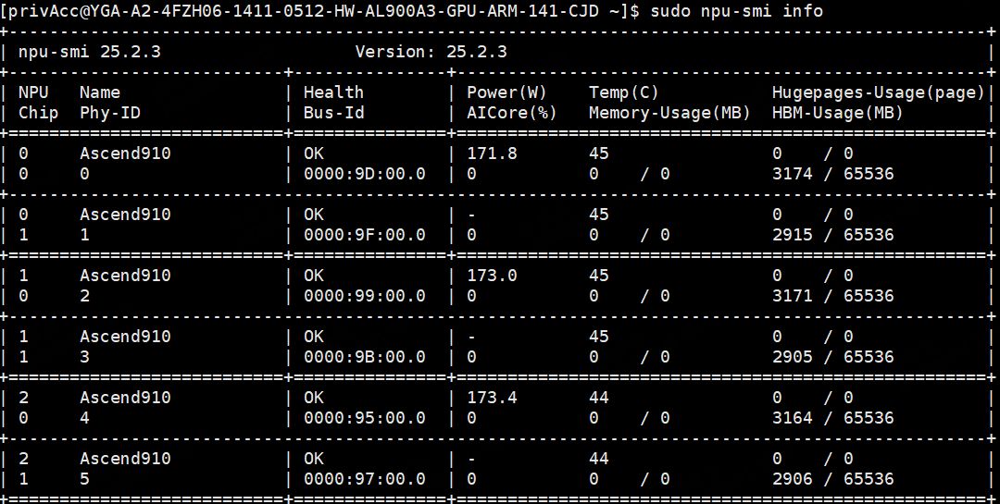

# Xing4.0-29B-A4B 国产化实战指南

目前，最新一代的**星辰语义大模型 Xing4.0-29B-A4B** 已全面完成对 Atlas 800T A3 算力集群的兼容适配。开发者可以无缝依托 MindSpore 与 MindFormers 框架，高效执行 Xing4.0-29B-A4B 的分布式训练与各项基准评测。具体的环境配置与执行步骤，请参阅指南；若需进一步探索底层框架的高阶特性或源码实现，欢迎访问[MindSpore Transformers 文档 | MindSpore Transformers 1.3.2 文档 | 昇思MindSpore社区](https://www.mindspore.cn/mindformers/docs/zh-CN/r1.3.2/index.html)。

## 1. 概述与核心组件简介

　　本指南旨在帮助开发者在基于昇腾 910C 算力底座（如 Atlas 800T A3 训练服务器 / Atlas 900 A3 集群节点）上，从零开始搭建环境，并进行 Xing4.0-29B-A4B 模型微调。

　　**核心支撑组件：**

- **昇思 MindSpore：**  华为自主研发的深度学习框架，原生支持昇腾 NPU，提供高效的自动微分与计算图优化能力。
- **MindSpore Transformers：**  专为大模型打造的训练、微调与推理套件，内置了完善的张量并行（MP）、流水线并行（PP）及序列并行（CP）等分布式策略。

## 2. 检查当前 NPU 状态与系统环境

　　在进行任何驱动或固件安装之前，必须确认服务器内 910C 芯片的基础状态，并查看是否已存在旧版驱动。

### 2.1 硬件在位检测

　　登录服务器，使用以下命令检查 NPU 板卡在位信息及当前固件版本：

```bash
npu-smi info -t board -i 1
```

　　执行该命令后，您应能看到类似如下的输出（注意确认 Chip Count ，对于 910C，由于是双芯设计，相关识别信息可能与单芯有所不同，具体以实际回显为准）：

```bash
NPU ID                           : 0
Product Name            : [型号信息]
Manufacturer             : Huawei
Software Version      : [当前版本]
Firmware Version      : [当前固件版本]
Compatibility               : OK
...
```


> 如果终端提示 command not found ，则说明当前系统尚未安装昇腾驱动，可以安全进入下一步。

### 2.2 监控 NPU 健康度

　　通过基础信息命令查看芯片运行状态、功耗、温度及显存占用：

```bash
npu-smi info
```

　　确保列表中所有可见的 910C 芯片在 `Health` 列均显示为 `OK`。



## 3. 驱动与固件安装指南

　　针对昇腾 910C，我们需要安装匹配该架构的驱动（Driver）和固件（Firmware）。本章节以官方驱动版本 `25.2.3` 和固件版本 `7.7.0.10.220` 为例进行演示。请务必前往华为官方渠道下载适用于开发设备的安装包。

### 3.1准备工作与依赖安装

- 全新安装（或已彻底卸载旧环境）： 必须遵循 先安装驱动 (Driver) → 后安装固件 (Firmware) 的顺序。
- 覆盖升级（系统已有旧版本且未卸载）： 必须遵循 先更新固件 (Firmware) → 后更新驱动 (Driver) 的顺序。

　　在安装前，需为下载的 .run  文件赋予执行权限，并校验文件完整性，防止因下载中断导致的文件损坏。
固件下载地址：[Ascend HDK Ascend-hdk-910b-npu-firmware_7.7.0.10.220.run 软件下载 - 华为](https://support.huawei.com/enterprise/zh/software/266821732-ESW2001553343)
驱动下载地址：[Ascend HDK Ascend-hdk-910b-npu-driver_25.2.3_linux-aarch64.run 软件下载 - 华为](https://support.huawei.com/enterprise/zh/software/266821732-ESW2001553344)
更多请访问官方网站获取：[社区版-固件与驱动-昇腾社区](https://www.hiascend.com/hardware/firmware-drivers/old/community?product=4&model=34&cann=All&driver=Ascend+HDK+25.5.2)

```bash
# 为安装包赋予执行权限 (此处仅为示例版本，请替换为您实际下载的适用包)
chmod +x Ascend-hdk-910b-npu-driver_25.2.3_linux-aarch64.run
chmod +x Ascend-hdk-910b-npu-firmware_7.7.0.10.220.run

# 校验软件包完整性
./Ascend-hdk-910b-npu-driver_25.2.3_linux-aarch64.run --check
./Ascend-hdk-910b-npu-firmware_7.7.0.10.220.run --check
```

　　校验输出若显示 100% SHA256 checksums are OK  即表示正常。同时，需在系统中安装构建驱动所需的依赖
（以 Debian/Ubuntu 系列为例）：

```bash
apt-get update
apt-get install -y dkms gcc net-tools pciutils
```

### 3.2 执行安装流程 (以全新安装为例)

　　按照前述规则，我们首先安装驱动包：

```bash
# 安装驱动
./Ascend-hdk-910b-npu-driver_25.2.3_linux-aarch64.run --full-install-for-all
```

　　等待安装过程，如果出现错误提示 [ERROR] The list of missing tools: lspci, ifconfig ，请回头确
认 pciutils  和 net-tools  是否已正确安装。成功后终端会输出： Driver package installed
successfully! 。

　　关键步骤： 驱动安装完成后，必须重启系统才能使内核模块生效。

```bash
reboot
```

　　系统重启完毕重新登录后，继续安装固件包：

```bash
# 安装固件
./Ascend-hdk-910b-npu-firmware_7.7.0.10.220.run --full
```

　　当看到 Firmware package installed successfully!  提示后，表示固件刷写完成。为了让新的固件在下
一次上电时生效，建议再次重启系统：

```bash
reboot
```

### 3.3 最终验证

　　再次登录服务器，执行环境检查命令：

```bash
npu-smi info
```

　　核实驱动版本是否为刚安装的版本，并确认所有卡状态为 OK 。至此，昇腾 910C 的底层硬件环境准备
完毕。


　　另外，如果您后续需要彻底清理环境以进行降级或排错，可以使用以下命令卸载驱动与固件：

```bash
# 卸载驱动
/usr/local/Ascend/driver/script/uninstall.sh

# 卸载固件
/usr/local/Ascend/firmware/script/uninstall.sh
```

## 4. 容器环境准备与配置

　　安装 Docker 引擎并拉取 Ascend 基础镜像：
华为昇腾提供了统一的容器镜像托管平台 **AscendHub**，所有官方维护的包含驱动适配层、CANN 算子库以及 MindSpore 框架的基础镜像均托管在此。选取匹配开发环境的基础镜像与拉取命令，这里以基于 **openEuler 22.03** 操作系统以及 **A3 (昇腾 910C)**  芯片架构为例。

### 4.1 Docker 引擎安装与启动

```bash
# 安装 docker 与 runc
dnf install -y docker runc

# 启动 docker 服务
sudo systemctl start docker

# 检查本地镜像状态
sudo docker images
```

### 4.2 构建定制化训练镜像

　　本项目的 `Dockerfile` 采用离线包安装与本地源码引用相结合的设计：CANN、MindSpore、Torch 等大体积底层组件通过离线 `.run` 和 `.whl` 文件安装；而 `mindformers` 和 `hyper_parallel` 等顶层组件通过 `COPY` 源码并注入 `PYTHONPATH` 的方式加载。保证部分组件严格的版本互斥约束，方便开发者在容器内进行源码级的调试与修改。此部分可参考在 MindFormers 中接入 FlagOS-mHC Triton 算子并验证 Xing4.0-29B-A4B 单机 16 卡训练中的内容。

#### 4.2.1 准备构建物料

　　在执行构建前，请务必在 `Dockerfile` 同级目录下准备好以下依赖包及源码结构：

```text
├── Dockerfile
├── requirements.txt
├── package/
│   ├── Ascend-cann_9.0.0_linux-aarch64.run           # CANN 基础包
│   ├── Ascend-cann-A3-ops_9.0.0_linux-aarch64.run    # CANN A3 专属算子包
│   ├── torch_wheels/                                 # 存放 torch 2.7.1 与 torch-npu 离线包
│   └── triton_wheels/                                # 存放 Triton 离线包
├── mindspore-2.10.0-cp311-cp311-linux_aarch64.whl    # MindSpore 安装包
├── mindformers/                                      # MindFormers 源码目录
└── hyper-parallel/                                   # Hyper_Parallel 源码目录
```

#### 4.2.2 执行构建

　　在准备好上述目录结构后，执行以下命令构建镜像：

```bash
docker build -t ms-hyper-parallel:2.10.0-cann9.0 .
```

### 4.3 运行容器

　　启动容器时，必须将宿主机的 NPU 物理设备节点以及底层驱动目录挂载进容器内部。请执行以下命令运行容器：

```bash
docker run -itd -u 0 --ipc=host --network host \
  --name xing4.0_29b_a4b_trainer \
  --privileged \
  --device=/dev/davinci0 \
  --device=/dev/davinci1 \
  --device=/dev/davinci2 \
  --device=/dev/davinci3 \
  --device=/dev/davinci4 \
  --device=/dev/davinci5 \
  --device=/dev/davinci6 \
  --device=/dev/davinci7 \
  --device=/dev/davinci8 \
  --device=/dev/davinci9 \
  --device=/dev/davinci10 \
  --device=/dev/davinci11 \
  --device=/dev/davinci12 \
  --device=/dev/davinci13 \
  --device=/dev/davinci14 \
  --device=/dev/davinci5 \
  --device=/dev/davinci_manager \
  --device=/dev/devmm_svm \
  --device=/dev/hisi_hdc \
  -v /usr/local/Ascend/driver:/usr/local/Ascend/driver \
  -v /usr/local/sbin/npu-smi:/usr/local/sbin/npu-smi \
  -v /var/log/npu/conf/slog/slog.conf:/var/log/npu/conf/slog/slog.conf \
  -v /var/log/npu/slog/:/var/log/npu/slog \
  -v /var/log/npu/profiling/:/var/log/npu/profiling \
  -v /var/log/npu/dump/:/var/log/npu/dump \
  -v /var/log/npu/:/usr/slog \
  -v /您的本地数据路径:/workspace \
  ms-hyper-parallel:2.10.0-cann9.0 \
  /bin/bash
```

　　(注：最后一行挂载路径 `/您的本地数据路径` 请根据宿主机实际保存模型权重与数据的绝对路径进行替换。)

### 4.4 容器内环境配置与验证

　　借助 `Dockerfile` 中前置编写的 `ENV` 指令，进入容器后，系统已自动完成了诸如 `ASCEND_TOOLKIT_HOME`、`LD_LIBRARY_PATH` 及源码级 `PYTHONPATH` 的环境变量配置。

　　进入容器：

```bash
docker exec -it xing4.0_29b_a4b_trainer bash
```

　　为了确保计算图引擎、算子库以及上层组件被正确激活，请依次执行以下 Python 验证命令：

#### 4.4.1 验证 MindSpore 与 NPU 连通性

```bash
python -c "import mindspore; mindspore.set_context(device_target='Ascend'); mindspore.run_check()"
```

> **预期结果：**  终端输出 `MindSpore version: 2.10.0` 以及 `The result of multiplication calculation is correct, MindSpore has been installed on platform`，证明 NPU 乘加运算与框架对接正常。

#### 4.4.2 验证顶层套件源码加载状态

```bash
# 验证 MindFormers 是否正确加载
python -c "import mindformers; mindformers.run_check()"

# 验证 HyperParallel 依赖及其路径来源
python -c "import hyper_parallel, os; print('HyperParallel Loaded From:', os.path.dirname(hyper_parallel.__file__))"
```

> **预期结果：**  终端无报错，且 `hyper_parallel` 和 `mindformers` 的加载路径均指向容器内的 `/opt/src/...` 源码目录，表明环境已对齐。

## 5. 模型训练和配置

　　本节以单机 16 卡 Graph Mode 短步数训练验证的核心配置说明，并行策略、序列长度和训练步数为适合单机跑通验证的设置。

### 5.1 启动训练

　　在 MindFormers 根目录执行以下命令，启动单机 16 卡 Graph Mode 训练验证：

```bash
bash scripts/msrun_launcher.sh "python run_mindformer.py --mode 0 --config ./xing4.0_29b_a4b_single_graph_4096.yaml" 16
```

　　训练日志默认写入 `output/msrun_log`，可查看最后一个 worker 日志观察训练状态：

```bash
tail -f output/msrun_log/worker_15.log
```

### 5.2 msrun_launcher.sh 解析

　　`scripts/msrun_launcher.sh` 是 MindFormers 多进程启动脚本，用于封装 `msrun`。本样例命令传入两个参数：

```bash
bash scripts/msrun_launcher.sh "python run_mindformer.py --mode 0 --config ./xing4.0_29b_a4b_single_graph_4096.yaml" 16
```

　　参数含义如下：

| 参数                 | 本样例取值                                                                              | 说明                              |
| -------------------- | --------------------------------------------------------------------------------------- | --------------------------------- |
| `EXECUTE_ORDER`    | `python run_mindformer.py --mode 0 --config ./xing4.0_29b_a4b_single_graph_4096.yaml` | 每个 worker 实际执行的训练命令    |
| `WORKER_NUM`       | `16`                                                                                  | 所有 worker 总数，单机 16 卡即 16 |
| `LOCAL_WORKER`     | 自动等于`WORKER_NUM`                                                                  | 两参数启动时脚本会设置为 16       |
| `MASTER_ADDR`      | `127.0.0.1`                                                                           | 单机默认主节点地址                |
| `MASTER_PORT`      | `8118`                                                                                | `msrun` 默认端口                |
| `LOG_DIR`          | `output/msrun_log`                                                                    | worker 日志目录                   |
| `JOIN`             | `False`                                                                               | 是否等待所有分布式进程退出        |
| `CLUSTER_TIME_OUT` | `7200`                                                                                | 分布式启动等待时间，单位秒        |

　　两参数启动时，脚本会进入单机场景：

```bash
WORKER_NUM=16
LOCAL_WORKER=16
SINGLE_NODE=true
```

　　最终拼出的核心命令等价于：

```bash
msrun --bind_core=True \
  --worker_num=16 \
  --local_worker_num=16 \
  --master_port=8118 \
  --log_dir=output/msrun_log \
  --join=False \
  --cluster_time_out=7200 \
  python run_mindformer.py --mode 0 --config ./xing4.0_29b_a4b_single_graph_4096.yaml
```

### 5.3 运行模式与权重加载

```yaml
context:
  mode: 0
  device_target: "Ascend"
  max_device_memory: "57GB"
  mempool_block_size: "57GB"

load_checkpoint: "/path/to/xing4.0_29b_a4b_checkpoint"
load_ckpt_format: "safetensors"
auto_trans_ckpt: True
remove_redundancy: True
resume_training: False
```

　　`context.mode: 0` 表示使用 Graph Mode。`load_checkpoint` 用于指定待加载的 Xing4.0-29B-A4B 权重目录，`load_ckpt_format: "safetensors"` 表示按 safetensors 格式加载权重。`auto_trans_ckpt: True` 与 `remove_redundancy: True` 用于适配分布式权重转换和冗余参数处理；`resume_training: False` 表示本次验证不恢复优化器等训练状态。

### 5.4 训练步数与 batch

```yaml
runner_config:
  epochs: 1
  batch_size: 1
  sink_mode: True
  sink_size: 1
  gradient_accumulation_steps: 1

callbacks:
  - type: TrainCallBack
    stop_step: 100
```

　　该配置用于短步数训练验证。`batch_size: 1` 表示单个数据并行分片的 batch 大小为 1，`gradient_accumulation_steps: 1` 表示不额外累积梯度，`sink_size: 1` 便于逐步观察训练日志。`TrainCallBack.stop_step: 100` 会在 100 step 后停止训练，适合用于验证模型、数据、并行策略和优化器链路是否可以完整跑通。

### 5.5 优化器与学习率

```yaml
optimizer:
  type: Muon
  adamw_betas: [0.9, 0.95]
  adamw_eps: 1.e-8
  weight_decay: 0.1
  matched_adamw_rms: 0.2
  qk_clip_threshold: 100.0

lr_schedule:
  type: CosineWithWarmUpLR
  learning_rate: 4.0e-6
  lr_end: 4.0e-7
  warmup_lr_init: 0
  warmup_steps: 0
  total_steps: 100
```

　　优化器采用 `Muon`，学习率调度器为 `CosineWithWarmUpLR`，`total_steps: 100` 与短步数验证保持一致。

### 5.6 单机 16 卡并行配置

```yaml
parallel_config:
  data_parallel: 2
  model_parallel: 8
  pipeline_stage: 1
  context_parallel: 1
  ulysses_degree_in_cp: 1
  micro_batch_num: 1
  use_seq_parallel: True
  expert_parallel: 16

parallel:
  parallel_mode: 1
  enable_alltoall: True
  enable_parallel_optimizer: True
  full_batch: False
```

　　单机 16 卡的总并行规模为 `DP * MP * PP * CP = 2 * 8 * 1 * 1 = 16`。相比正式多机训练配置，该验证配置关闭流水线并行和上下文并行，将序列长度降至 4096，以降低单机跑通门槛；同时保留 `model_parallel: 8`、`expert_parallel: 16` 和 `enable_alltoall: True`，使 MoE 相关通信路径仍按正式模型链路验证。

　　`expert_parallel: 16` 表示 MoE Expert 在单机 16 张卡之间划分。当前模型 `n_routed_experts: 64`，可以被 `expert_parallel: 16` 整除，符合 MoE Expert 并行划分要求。

### 5.7 数据集配置

```yaml
train_dataset:
  input_columns: ["input_ids", "labels"]
  construct_args_key: ["input_ids", "labels"]
  data_loader:
    type: HFDataLoader
    load_func: "load_from_disk"
    dataset_path: "/path/to/hf_dataset"
    create_attention_mask: False
    create_compressed_eod_mask: False
    compressed_eod_mask_length: 128
    use_broadcast_data: True
    shuffle: True
    handler:
      - type: "PackingHandler"
        seq_length: 4096
        pack_strategy: "truncate"
```

　　数据集加载方式为 `HFDataLoader`，通过 `load_from_disk` 读取本地 Hugging Face Dataset。`PackingHandler` 将样本处理为 4096 token 长度，并使用 `pack_strategy: "truncate"` 对超长样本进行截断。

### 5.8 微调数据样例

　　指令微调数据通常包含系统提示词、用户与模型的对话内容，以及是否为多轮对话、是否包含工具调用等元信息。原始数据可采用 JSON Lines 格式组织，每行表示一条训练样本。以下为单轮对话样例：

```json
{
  "system": "你是中电信人工智能科技有限公司研发的面向智能体时代的新一代星辰大模型。\n",
  "dialog": [
    {
      "role": "user",
      "content": "给我推荐一本好看的小说吧。"
    },
    {
      "role": "bot",
      "content": " 如果你喜欢历史题材，我可以向你推荐一本红楼梦。如果你喜欢奇幻题材，我可以向你推荐《哈利波特》系列或《指环王》。如果喜欢悬疑题材，我可以推荐《福尔摩斯探案全集》。请告诉我您的喜好，我可以更好地推荐适合你的小说。"
    }
  ],
  "multiturn": false,
  "tool": false
}
```

　　其中，`system` 用于定义模型身份或任务背景；`dialog` 按顺序记录用户输入和模型回复；`multiturn` 表示该样本是否为多轮对话；`tool` 表示该样本是否涉及工具调用。实际训练前，需要结合模型 tokenizer 与训练模板将原始样本转换为 Hugging Face Dataset，并生成 `input_ids` 和 `labels` 字段，以匹配 `HFDataLoader` 与 `CausalLanguageModelDataset` 的输入要求。

### 5.9 模型配置

```yaml
model:
  model_config:
    model_type: "xing4.0"
    architectures: ["Xing4.0ForCausalLM"]
    vocab_size: 131072
    seq_length: 4096
    hidden_size: 3584
    intermediate_size: 9216
    num_hidden_layers: 40
    num_attention_heads: 32
    hidden_act: "swiglu"
    use_flash_attention: True
    use_attn_mask_compression: True
    multi_latent_attention: True
    position_embedding_type: "yarn"
    rotary_scaling_factor: 64.0
    params_dtype: "float32"
    compute_dtype: "bfloat16"
    n_routed_experts: 64
    num_experts_per_tok: 4
    n_shared_experts: 1
    moe_token_dispatcher_type: "alltoall"
    freeze_param_patterns: ".*router.*"
```

　　模型包含 40 层 Transformer，隐藏维度为 3584，词表大小为 131072；本验证配置将训练序列长度设为 4096。

## 6. 查看日志

　　默认日志目录：

```text
output/msrun_log
```

　　当前配置 `pipeline_stage: 1`，可查看任一 worker 日志观察启动和训练状态；通常可直接查看最后一个 worker 日志：

```bash
tail -f output/msrun_log/worker_15.log
```

　　建议重点检查以下日志信息：

```text
Running MindFormers in GRAPH_MODE.
Current world size: 16.
Distributed communication is initialized.
Got parallelism settings: data_parallel=2 ...
Loading checkpoint from: ...
```

　　训练正常后，日志中应持续出现 loss、lr、step time 等训练信息，如果 pipeline_stage > 1，请以最后一个 worker 日志中的 loss 为准。
